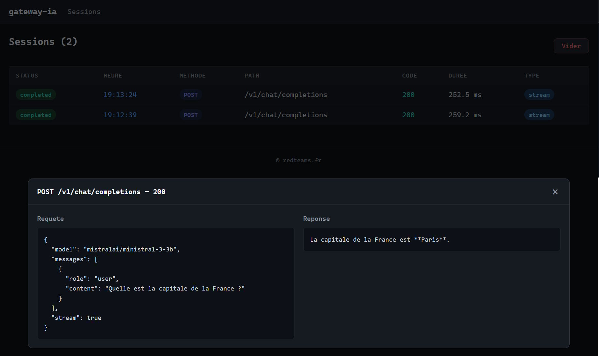
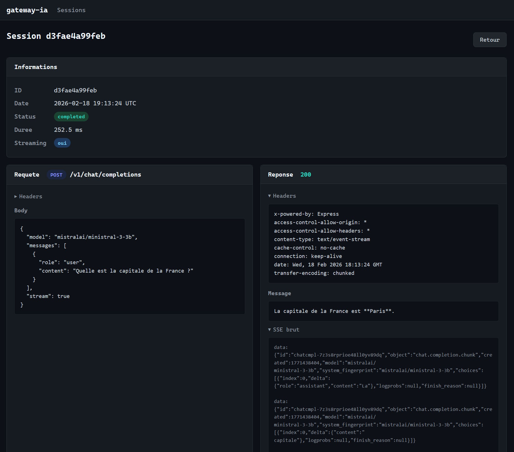

# LLMiddler

Transparent HTTP proxy for AI inference backends with session tracing.
LLMiddler sits between your clients and your inference service, captures the full request/response lifecycle (including SSE streaming), and provides a web UI to inspect and replay sessions.

Think of it as a Fiddler-style debugging tool built specifically for AI APIs.

## Overview





## Features

* **Transparent proxy**: Forwards all HTTP requests to the configured backend without modification (except hop-by-hop headers)
* **SSE support**: Real-time streaming passthrough with full body accumulation for later inspection
* **Streaming response aggregation**: Automatically reconstructs the final message from SSE `delta.content` chunks
* **Web UI**: Session list with AJAX auto-refresh, preview modal, detailed view with collapsible headers
* **In-memory storage**: Up to 1000 sessions with automatic FIFO eviction

## Requirements

* Python 3.12+
* [uv](https://docs.astral.sh/uv/) (package manager)

## Installation

```bash
uv sync
```

## Configuration

Edit `config.yaml` at the project root:

```yaml
backend:
  base_url: "http://172.24.208.1:1234"   # Inference backend URL
  timeout: 120                          # Timeout in seconds

proxy:
  host: "0.0.0.0"
  port: 8080

ui:
  prefix: "/_ui"

logging:
  level: "INFO"
```

You can override the configuration file path using the `GATEWAY_IA_CONFIG` environment variable.

## Running

```bash
uv run python -m gateway_ia
```

By default, the proxy listens on `http://localhost:8080`.

## Usage

1. Point your AI clients to the proxy instead of the direct backend:

   ```
   http://localhost:8080/v1/chat/completions
   ```

2. Open the web interface to inspect traced sessions:

   ```
   http://localhost:8080/_ui/
   ```

3. Click a session for a quick preview (modal) or click the timestamp to access the full detail page.

## Docker

```bash
docker build -t llmiddler .
docker run -p 8080:8080 llmiddler
```

To override the configuration, mount your own file:

```bash
docker run -p 8080:8080 -v ./config.yaml:/app/config.yaml llmiddler
```

## Project Structure

```
llmiddler/
├── pyproject.toml
├── config.yaml
├── Dockerfile
├── lm_studio_stream.py              # Test script
└── gateway_ia/
    ├── __init__.py
    ├── __main__.py                  # Entry point (uvicorn)
    ├── app.py                       # FastAPI factory + lifespan
    ├── config.py                    # YAML loading + Pydantic models
    ├── models.py                    # Session model
    ├── store.py                     # In-memory store (thread-safe, bounded)
    ├── routers/
    │   ├── proxy.py                 # Catch-all proxy
    │   └── ui.py                    # /_ui routes + JSON API
    ├── services/
    │   └── proxy_service.py         # Forwarding logic
    └── templates/
        ├── base.html
        ├── session_list.html
        └── session_detail.html
```
